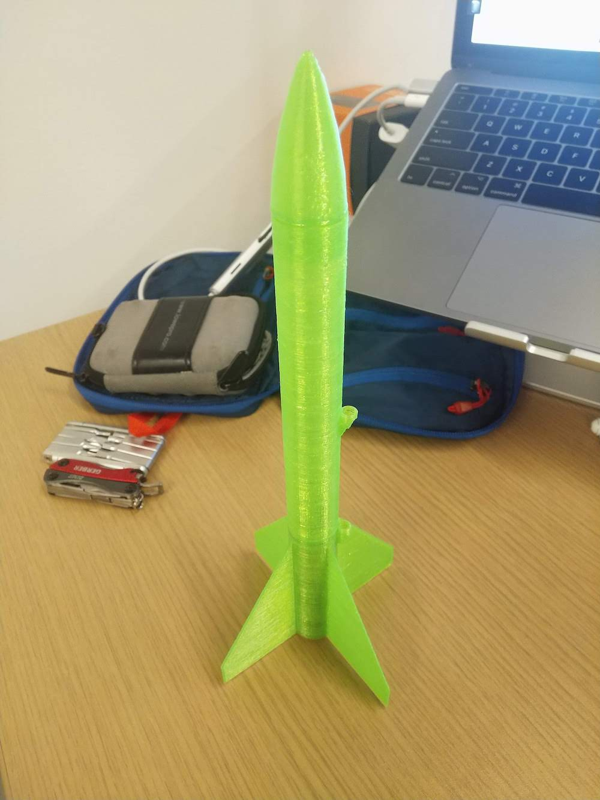
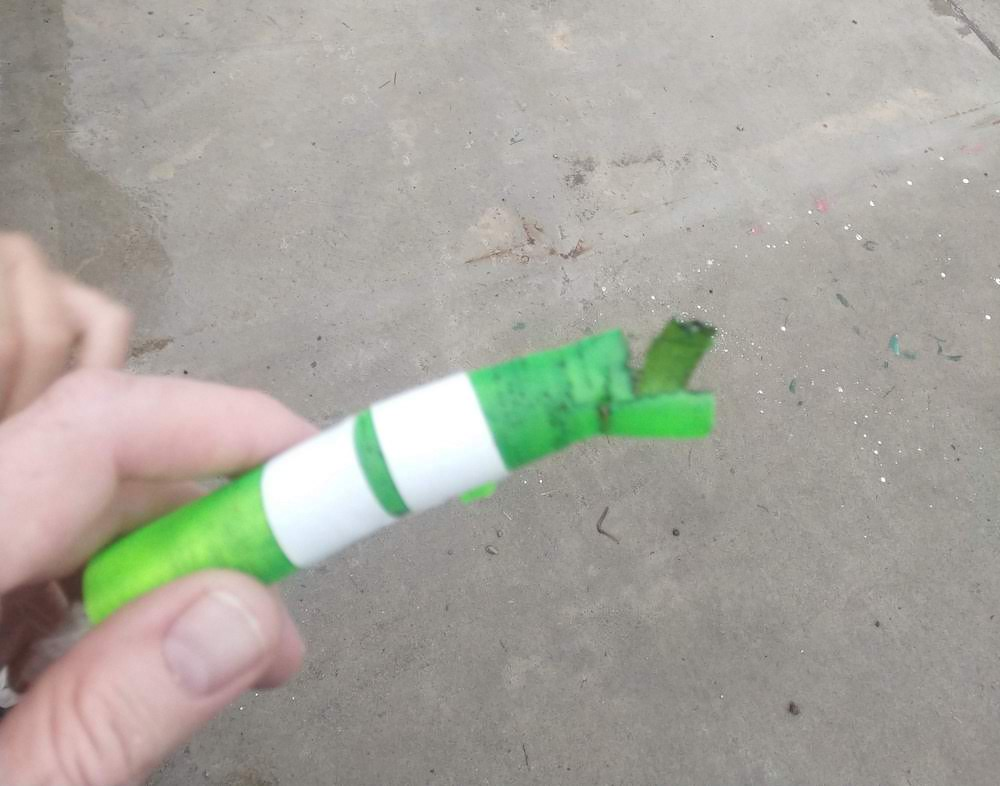
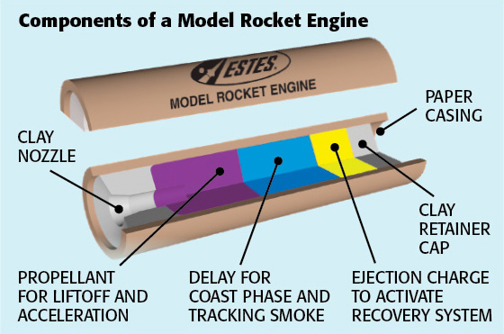
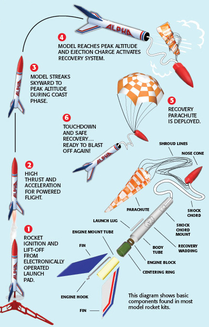

My old work ([TWG](http://twg.ca)) had a 3D printer for employees to play with and use. In
the summer of 2019 my son was getting into model rocket launching, but we kept losing
them in trees. So I decided to try 3d printing some rockets. It never really worked out,
but in my new spirit of blogging failures, I'm posting about it. My goal was to make
my own easily produced reusable rocket.

I am not a rocket scienctist or enginer, but I've played a fair bit of
[Kerbal Space Program](https://www.kerbalspaceprogram.com/)
and watched a lot of [Scott Manley](https://www.youtube.com/channel/UCxzC4EngIsMrPmbm6Nxvb-A)
videos. I didn't really incorporate any proper rocket design into my ideas here. I
designed the rockets with these over-sized fins to facilitate 3d printing, by having a 
larger contact area on the printing surface.

In terms of "easily produced" I wanted something I could easily print at work, i.e. I could 
fire something up in a few minutes and have it finish within a morning or afternoon so I
wasn't wasting a lot of time at work doing this.

Unfortunately the launch wasn't a success. It would launch, fly hundreds of feet into the
air, then blow up:

The issue arises from how a model rocket engine works. After ignition, the engine burns
it's propellant, launching the rocket high into the sky. After this is burned up, a 
time delaying, non-propelling burn occurs, to allow the rocket to use its forward momentum
up before deploying the parachute at apogee. Once the time delay is used up, a smaller
charge blows upward into the rocket's body, pushing off the nose cone and the chute. This is
shown in the images below:

[Image source](https://estesrockets.com/get-started/)

My problem was the my single-walled rocket couldn't handle the pressure of the chute charge,
so the fuselage would rupture. They were all blowing up at step 4 in the launch
sequence image above. I think this is slightly compounded by the 3d print ridges 
adding more friction to the nose cone removal, but the weak body is probably the main issue.

I tried iterating on the design by taping the outside of the fuselage to reinforce it (still not strong 
enough), and having a wider diameter of fuselage to reduce internal pressure (also not strong enough). The real solution is 
probably one of: print a thicker fuselage, (but this would have taken too 
long), or to slide a paper tube into the fuselage to handle the
pressure, (but I didn't want to source those). I shelved the project having run out
of desirable alternatives.