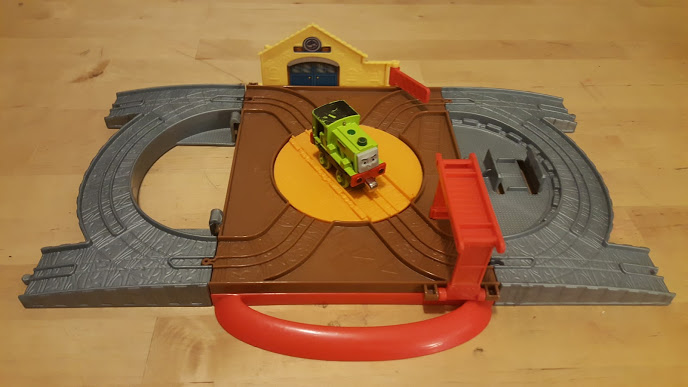
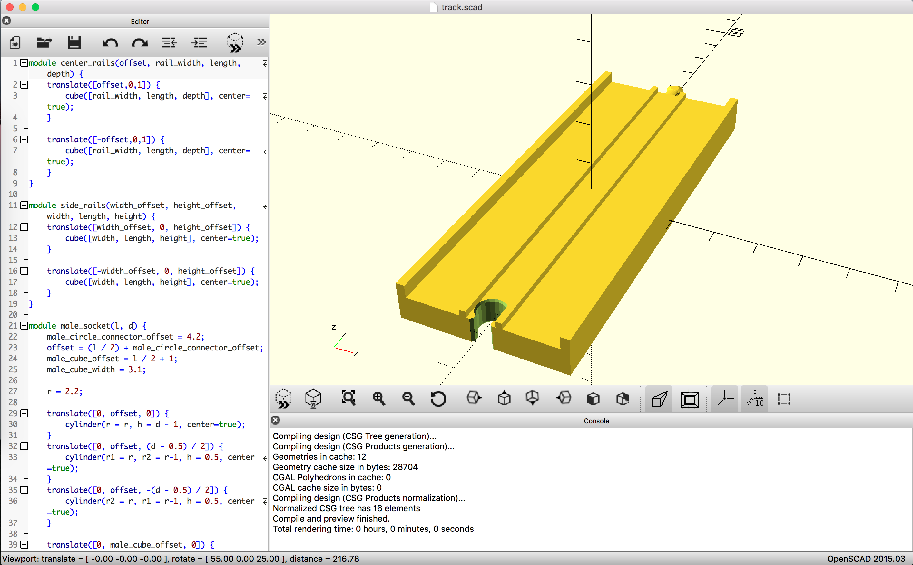
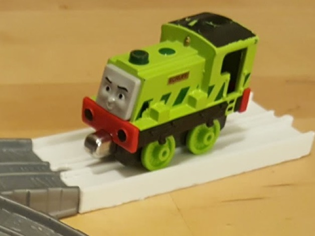

My work ([TWG](http://twg.ca)) has a 3D printer for employees to play with and use. Sometime
last summer I downloaded some train tracks from thingiverse and printed them for my son to play
with. He loves the custom tracks dearly. He's always excited to visit my work to 
see what a coworker called "the toy factory". And often he will ask me to print him something
while I'm at work. So I get a lot of emotional reward from using this machine.

<span class="more"></span>

Thomas and Friends (based on the books by Rev. Audrey) has a line of toys called "wooden
railway". The tracks are an ad hoc standard, and work with many different brands including
Brio (my favourite), imaginarium, Melissa and Doug, and (for the most part) Ikea. You can
find lots of designs for [brio compatible tracks on thingiverse](https://www.thingiverse.com/tag:brio).
Seemingly all kids love these.

Unfortunately for parents, there are also Thomas "Take 'n Play" trains which are about 70% of the size
of the wooden railway models. The engines and rolling stock don't fit on the same track, and the track connectors
are incompatible. I accidentally bought my boy a Take 'n Play engine
once, and my son received a track set as a gift from a grandparent. This was quite a limited set that
didn't offer much room for creativity.



My son enjoyed it, but he asked me to print tracks that would work for this system.
I checked thingiverse and google and could find none. This provided the challenge I needed to design and
make my own 3D models.

I chose to use [openSCAD](http://www.openscad.org/) for modelling. I was reading a comparison of different
modelling software and it said that openSCAD has `for` loops, and I was sold. I love a good `for` loop.

openSCAD has three primitives and extrudable polygon support, as well as several object transformations like
skewing and resizing. It also supports `module` which works similar to a function call and allows you to
repeat groupings of commands to repeat code and make it more readable. With these tools you can build up more 
complex designs.



Designing the object was an interesting process. At first I built a simple version of the object with 
primitives and hard-coded dimension values, which I measured with a micrometer. My next step was to
factor common variables and move objects and transformations out into modules.

Because I generally have at least a few lines of code in my blog posts, here's a simple module that
defines the center rails for my track design:

```
module center_rails(offset, rail_width, length, depth) {
    translate([offset,0,1]) {
        cube([rail_width, length, depth], center=true);
    }

    translate([-offset,0,1]) {
        cube([rail_width, length, depth], center=true);
    }
}
```

You can see the [whole code in a github repo](https://github.com/rbwendt/take-n-play-straight-track),
or [get this object on thingiverse](http://www.thingiverse.com/thing:1477289).



Through this process I learned that what you measure with a ruler isn't necessarily what you need
to print to have a working model. I created about eight prototype pieces before I had compatible male
and female connectors. In my first attempt, I used the same measurements for each, but this didn't work 
because the connectors need a little bit of space to slide past one another. It was a really fun process
and I'm very much looking forward to showing these to my son tomorrow.

