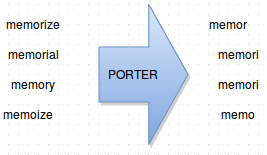

The goal of stemming is to reduce derived forms of a word to something that could be a root form. For example a possible stem of &#8220;lighting&#8221; or &#8220;lighted&#8221; is &#8220;light&#8221;. This is generally done by applying a list of fairly simple rules to a word, possibly recursively, until the algorithm is done and a root form is returned.

There are several reasons for stemming a word. The primary concern is to increase the recall of a search index. The most basic case here is the handling of plurals; a user generally expects the same result when searching for &#8220;nachos dip&#8221; as when they search for &#8220;nacho dip.&#8221; But recall can be improved in other cases as well, for example a user searching for &#8220;democracy&#8221; is probably also interested in results for &#8220;democratic&#8221;. Another concern is reducing index size; this can increase search speed and reduce storage usage (both of these are good for reducing costs).

But stemming is an inexact science. Most stemming algorithms don&#8217;t attempt to extract morphological information about the word to determine the stem, so unrelated terms can be conflated. While working at an old employer, one of my colleagues found an interesting issue caused by imprecise stemming. A client was complaining that a search for &#8220;rug&#8221; was matching most of the items in their catalog, even though most of them didn&#8217;t have anything to do with rugs. It turns out that, as an outdoor gear supplier, the client had the term &#8220;rugged&#8221; in most of the product descriptions on their site. The solution to this issue was to tweak the stemmer used for this index.

This example shows that, while stemming can improve recall, it reduces precision. As software developers, we are used to making these trade offs. The effectiveness of a given stemming method will vary depending on your corpus. So it&#8217;s important to learn the ins and outs of your stemmers, and learn when to tweak them.

I found an interesting [comparison of stemmer results][2] in an elastic search user forum.

<table>
  <tr>
    <th>
      Original
    </th>
    
    <th>
      porter
    </th>
    
    <th>
      kstem
    </th>
    
    <th>
      minStem
    </th>
    
    <tr>
      <tr>
        <td>
          country
        </td>
        
        <td>
          countri
        </td>
        
        <td>
          country
        </td>
        
        <td>
          country
        </td>
      </tr>
      
      <tr>
        <td>
          run
        </td>
        
        <td>
          run
        </td>
        
        <td>
          run
        </td>
        
        <td>
          run
        </td>
      </tr>
      
      <tr>
        <td>
          runs
        </td>
        
        <td>
          run
        </td>
        
        <td>
          runs
        </td>
        
        <td>
          run
        </td>
      </tr>
      
      <tr>
        <td>
          running
        </td>
        
        <td>
          run
        </td>
        
        <td>
          running
        </td>
        
        <td>
          running
        </td>
      </tr>
      
      <tr>
        <td>
          read
        </td>
        
        <td>
          read
        </td>
        
        <td>
          read
        </td>
        
        <td>
          read
        </td>
      </tr>
      
      <tr>
        <td>
          reading
        </td>
        
        <td>
          read
        </td>
        
        <td>
          reading
        </td>
        
        <td>
          reading
        </td>
      </tr>
      
      <tr>
        <td>
          reader
        </td>
        
        <td>
          reader
        </td>
        
        <td>
          reader
        </td>
        
        <td>
          reader
        </td>
      </tr>
      
      <tr>
        <td>
          association
        </td>
        
        <td>
          associ
        </td>
        
        <td>
          association
        </td>
        
        <td>
          association
        </td>
      </tr>
      
      <tr>
        <td>
          associate
        </td>
        
        <td>
          associ
        </td>
        
        <td>
          associate
        </td>
        
        <td>
          associate
        </td>
      </tr>
      
      <tr>
        <td>
          listing
        </td>
        
        <td>
          list
        </td>
        
        <td>
          list
        </td>
        
        <td>
          listing
        </td>
      </tr>
      
      <tr>
        <td>
          water
        </td>
        
        <td>
          water
        </td>
        
        <td>
          water
        </td>
        
        <td>
          water
        </td>
      </tr>
      
      <tr>
        <td>
          watered
        </td>
        
        <td>
          water
        </td>
        
        <td>
          water
        </td>
        
        <td>
          watered
        </td>
      </tr>
      
      <tr>
        <td>
          sure
        </td>
        
        <td>
          sure
        </td>
        
        <td>
          sure
        </td>
        
        <td>
          sure
        </td>
      </tr>
      
      <tr>
        <td>
          surely
        </td>
        
        <td>
          sure
        </td>
        
        <td>
          surely
        </td>
        
        <td>
          surely
        </td>
      </tr>
      
      <tr>
        <td>
          fred&#8217;s
        </td>
        
        <td>
          fred&#8217;
        </td>
        
        <td>
          fred&#8217;s
        </td>
        
        <td>
          fred&#8217;
        </td>
      </tr>
      
      <tr>
        <td>
          roses
        </td>
        
        <td>
          rose
        </td>
        
        <td>
          rose
        </td>
        
        <td>
          rose
        </td>
      </tr></table> 
      
You can see here that Porter earns its aggressive reputation. Aggressiveness leads to more matches, but also more false matches.

 [1]: http://benwendt.ca/blog/wp-content/uploads/2015/07/Screenshot-from-2015-07-08-213912.png
 [2]: http://www.gossamer-threads.com/lists/lucene/java-user/173564
