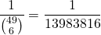

Having studied math in university, I am well aware that buying lottery tickets is a losing proposition. In Ontario, where I live, there is a lottery called 6/49. The rules are simple: pick 6 numbers out of 49 possibilities, if your choice matches a random choice of 6 numbers made in the draw, you win the jackpot. The probability of winning this is:

<span class="more"></span>



I.e. the odds are roughly one in 14 million. 

However, when you live in a densely populated city like Toronto, you notice that a lot of convenience stores have signs up in their windows proclaiming the jackpot winners who have bought tickets there. Generally these take the form of big banners reading something along the lines of &#8220;&dollar;16 million dollar ticket sold here!&#8221;

Each neighbourhood in the city only has so many convenience stores, each serving a neighbourhood that only has so many people buying lottery tickets, each of whom may or may not play in every draw. It was enough to make me wonder how long a given population size of occasional lottery players would take before one of their members recorded a win.

So I set up a model with the following characteristics:

  1. A configurable population size, I start with a population of 100,000, roughly the population of Guelph, which is a city near where I grew up.
  2. A configurable probability for population wide ticket buying. For the sake of my model, I chose 1/8, which is slightly more than one ticket buy per month (there are bi-weekly draws).
  3. Every week there is a draw, and 6 numbers are chosen from the 49. Every member of the population may or may not play. If they play, they also choose 6 numbers randomly from the 49, if these match, they win and the simulation ends. </ol> 
    Here&#8217;s my PHP code that represents the model I&#8217;ve described.
    
```php
<?php
function getRandomChoice($from, $number, $min = 1) {
	$from = range($min, $from);
	$choices = [];
	for ($i = 0; $i &lt; $number; $i++) {
		$index = mt_rand(0, count($from) - 1);
		$choices[] = $from[$index];
		unset($from[$index]);
		$from = array_values($from);
	}
	sort($choices);
	return $choices;
}

$population = 100000;
$playProbability = 1 / 8;

$match_found = false;
$count = 0;
while(!$match_found) {
	$r = getRandomChoice(49, 6);
	$bought = 0;
	for ($i = 0; $i &lt; $population; $i++) {
		
		$rand = mt_rand() / mt_getrandmax();
		if ($rand &gt; $playProbability) {
			continue;
		}
		$s = getRandomChoice(49, 6);
		$bought ++;
		if ($r == $s) {
			echo "match after $count draws, population member $i\n";
			echo implode(" ", $r) . ", "  . implode(" ", $s) . "\n";
			break 2;
		}
		
	}
	$count++;
	if ($count % 52 == 0) {
		$year = $count / 52;
		echo "tried $count times, $bought bought, year $year.\n";
	}
}

```
    
What I found from this was not very heartening for lottery players. It generally takes several years for even one member of the 100000 population to ever win the jackpot. But I do think that the results demonstrate why there are so many of those jackpot banners around town.
