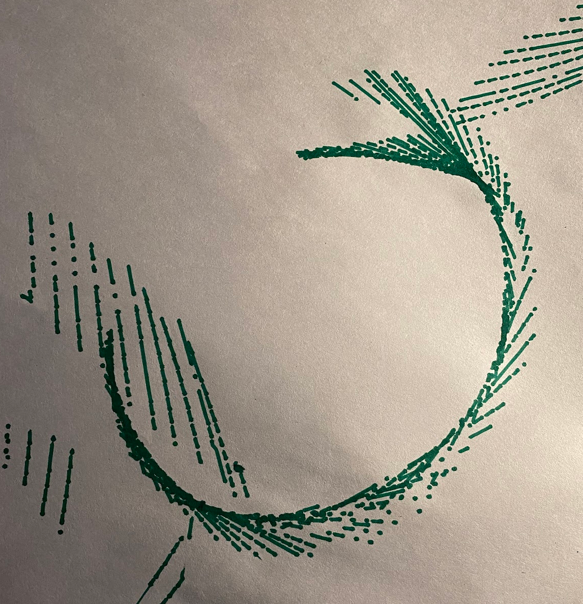
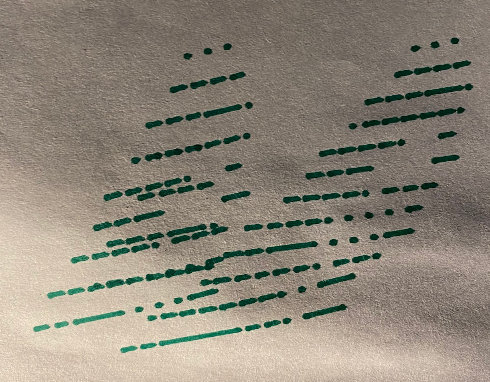

When I was a child, they had a plotter at my mom’s office. I don’t remember the model, but it was something like a [HP 7550A](http://hpmuseum.net/display_item.php?hw=75). I was fascinated by it, and I’m sure I watched it go for many hours. From that, I’ve always loved plotter technology. I’ve always kind of wanted to make my own. Last year, the urge became too great and I tried out the [branchiograph](https://www.brachiograph.art/) project. I didn’t get the best results for various reasons.

This Christmas, we got my son an [Artie 3000](http://codewithartie.com/) robot. It’s a python-codable (more on this) turtle-graphics-like robot that uses a pen to draw on paper. I decided to try to turn it into a plotter.

So my first let-down on this project is that, although python is supported, it’s only supported within the web interface you use to interact with the robot. There’s no public library to pip-install that lets you interact with the robot. So even though the box says “code in python” with a little screenshot showing an import command, it’s not really that easy. I thought about inspecting the web-socket traffic that controls the robot, but I thought I would try generating some python code for the robot that should draw something interesting before going to that effort.

I started by finding a decent image to try to draw. My obvious choice was Mario. I love trying to impress my kids, so I picked Mario. My son is nuts about Mario. I can’t blame him.

My first thought of row to take an rgb image and prepare it for printing in monochrome was just to do a threshold, but I quickly decided that wouldn’t look good at all. Thankfully I was alive in the 90s, and I remembered how people used to try to make 8-bit images look good: dithering! If it works for 8 bits, why not 1? The [low-tech magazine](https://solar.lowtechmagazine.com/) uses the same 1-bit dithering technique to reduce their image sizes.

Here’s what Mario looks like after resizing and dithering to 1-bit:

I wrote some fairly trivial code to convert this row-wise into a series of turtle commands. Here is my first result:

I love this cool spiral look, but there’s a clear problem here. You can see that there’s a big spiral. This is because and the end of each row, the robot turns left, moves to the next row, and turns back right. But it has a slight preference to the left, about 4 degrees in my tests. My image was 70 rows, so that means the robot would have turned 210 degrees by the time it finished printing.

I ran some tests to manually correct for the turning bias, and got more results:

This is two prints over one-another. You can make out Mario’s hat, but the line pitch is all wrong.

I got a bit discouraged at this point because it seems pretty clear that the robot has a minimum distance it will go forward after turning. I’m not sure why. I experimented with getting it to move forward too far, and backing up to get the desired line pitch, but I couldn’t get it lined up right. It’s probably not insurmountable but I think I may have reached my personal point where this project ceased being fun. Projects that are given up on mid-way can be noteworthy too, so I thought I would put up a post.