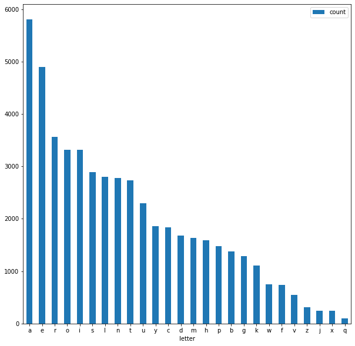

[Wordle](https://www.powerlanguage.co.uk/wordle/) is a popular word deduction game. The
aim is to guess a word given six guesses. You can only guess valid English words that
are in wordle's dictionary. Each wrong guess will yield hints. A letter
highlighted in yellow indicates it matches the target word somewhere. A letter marked in
green indicates the correct letter in the correct position. I feel like a branching
strategy (preferably choosing from common letters) is the best. But what word should you
start with? And what is the worst word to start with?

<span class="more"></span>

Using the timeless magic of "inspect element" I grabbed the complete dictionary of 10657
words wordle considers to be valid (compare this to 10230 in my `/usr/share/dict/words`
on mac). Wordle's word list is pretty liberal with what it considers to be a valid
English word, containing things like:

* [owled](https://findwords.info/term/owled)
* [rusma](https://en.wiktionary.org/wiki/rusma)
* [sango](https://en.wikipedia.org/wiki/Sango)
* [thymi](https://www.collinsdictionary.com/dictionary/english/thymi)

So what is the best and worst word to start? The rules of the game mean that the first guess
will be best when it draws from the most common letters in the dictionary. So what are the 
most common letters in wordle's set of five letter words? Here's the distribution:



We can see here that z, j, x, q are the least commonly used letters, but words also need
vowels, and y is the least common vowel. Unfortunately, no words use only there letters.
Through trial and error of adding more commonly used letters, I found the word [xylyl](https://www.merriam-webster.com/medical/xylyl), which draws mostly from uncommon letters,
but I wanted to be a bit more sure.

Here's a couple methods that calculate two words "yellow" and "green" scores:

```python
def yellow_matches(w, x):
    return len(set(w).intersection(x))

def green_matches(w, x):
    return len([z for (y, z) in zip(w, x) if y == z])
```

Using this we can check each words score against all other words. Sorting by yellows, then greens gives these best starting words:

|      | word   |   yellow |   green |
|-----:|:-------|---------:|--------:|
|  112 | aeros  |    20698 |    7505 |
| 8530 | soare  |    20698 |    5610 |
| 7414 | reais  |    20402 |    7482 |
| 8109 | serai  |    20402 |    4800 |
|  113 | aesir  |    20402 |    3618 |
|  257 | aloes  |    20092 |    7774 |
| 9373 | toeas  |    19992 |    8021 |
| 8810 | stoae  |    19992 |    4119 |
| 4998 | lares  |    19926 |    9414 |
| 7336 | rales  |    19926 |    9149 |

Or sorted by greens, then yellows:

|      | word   |   yellow |   green |
|-----:|:-------|---------:|--------:|
| 8609 | sores  |    16277 |    9982 |
| 7897 | sanes  |    16625 |    9914 |
| 7867 | sales  |    16854 |    9825 |
| 8577 | sones  |    15442 |    9772 |
| 8568 | soles  |    15671 |    9683 |
|  680 | bares  |    18712 |    9661 |
| 1423 | cares  |    18932 |    9649 |
| 6602 | pares  |    18999 |    9642 |
| 7930 | sates  |    16754 |    9594 |
| 9100 | tares  |    19826 |    9591 |

So it looks like "aeros" and "sores" are good starting words. I don't think the
actual winning words ever end with 's', so let's look at those options. Most yellows:

|      | word   |   yellow |   green |
|-----:|:-------|---------:|--------:|
| 8530 | soare  |    20698 |    5610 |
| 8109 | serai  |    20402 |    4800 |
|  113 | aesir  |    20402 |    3618 |
| 8810 | stoae  |    19992 |    4119 |
| 5007 | laser  |    19926 |    5371 |
| 8110 | seral  |    19926 |    4851 |
| 9115 | taser  |    19826 |    5548 |
| 8839 | strae  |    19826 |    4405 |
| 2639 | earst  |    19826 |    4044 |
| 7532 | resat  |    19826 |    3747 |

Most greens:

|      | word   |   yellow |   green |
|-----:|:-------|---------:|--------:|
| 7913 | saree  |    17460 |    7300 |
| 8606 | soree  |    16277 |    7158 |
| 7912 | sared  |    19388 |    6907 |
| 8605 | sored  |    18205 |    6765 |
| 8584 | sooey  |    14819 |    6711 |
| 7896 | saned  |    18553 |    6697 |
| 1083 | boree  |    12211 |    6695 |
| 7365 | raree  |    12142 |    6624 |
| 4997 | laree  |    14608 |    6590 |
| 7890 | samey  |    17572 |    6554 |

And now let's look at the worst starting options:

|       | word   |   yellow |   green |
|------:|:-------|---------:|--------:|
| 10377 | xylyl  |     4330 |    1425 |
|  3275 | fuffy  |     4376 |    2751 |
|  3836 | gyppy  |     4396 |    2382 |
|  4261 | hyphy  |     4482 |    2118 |
|  1728 | cocco  |     4710 |    3467 |

Those look like some terrible options to start with, but today I started with "aeros", and the
correct answer was "proxy". I think I would have been better off starting with the "xy" 
from "xylyl" as those are higher value letters.