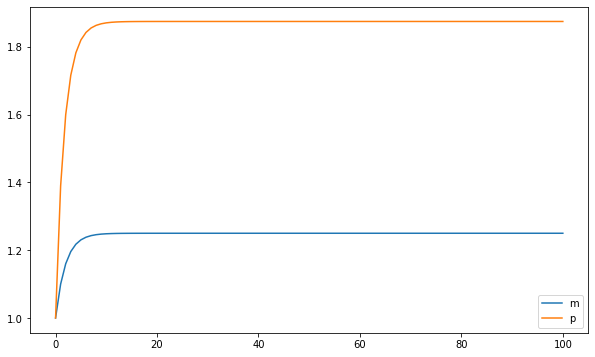
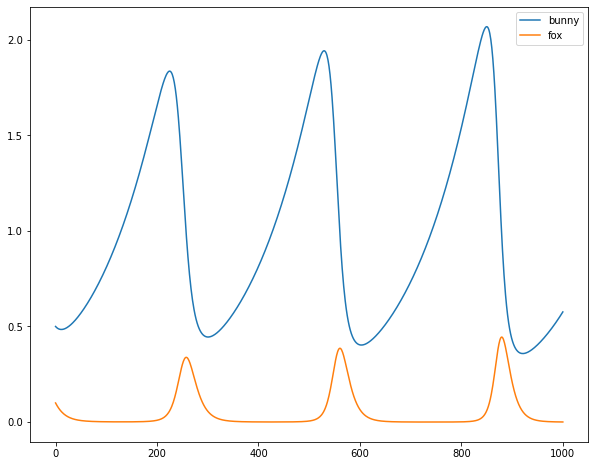
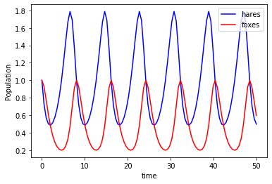

At my new job our focus is to uncover scientific insights
to accelerate and improve scientific research. I'm a data
engineer by trade, but the science side of the business
bleeds in to what I do on a fairly regular basis. Without
the scientific and research background that many of my
peers have, I feel the need to do some self improvement
in those areas. So I was happy to find a series of videos
on youtube titled [Computational Biology with Python
(Modeling Gene Networks)](https://www.youtube.com/playlist?list=PLWVKUEZ25V97W2qS7faggHrv5gdhPcgjq) created by [Mike
Saint Antoine](https://www.youtube.com/channel/UCti8KSLHdoVd7K0VZwUZk_g)

<span class="more"></span>

The video series centers around modeling ordinary
differential equations and stochastic differential
equations using python, specifically for gene
expression, and the central dogma of molecular
biology. This was great for me, because that is a
topic that has come up at work, so it was a great
chance to bridge my history of working with code,
and my ancient (university days) history of working
with math.

The central dogma of molecular biology is that
information flows from DNA to mRNA to proteins. That
is DNA is transcibed into mRNA and mRNA expresses
proteins. I think.

DNA ➡ mRNA ➡ protein

This is modeled roughly as:

```python
mrna_change = k_m - gamma_m * m
protein_change = k_p * m - gamma_p * p
```

So the amount of mRNA has a constant upward
change, but it slows down as more mRNA is present. And
the amount of the protein goes up proportional to the
amount of mRNA present and decreases proportional to the
amount of protein present.

I went ahead and coded the model for myself before the
videos showed a solution. Here's my code:

```python
m_0 = 1.0
p_0 = 1.0
gamma_m = 0.4
gamma_p = 0.6
k_m = 0.5
k_p = 0.9

def next_m_p(m, p):
    m += k_m - gamma_m * m
    p += k_p * m - gamma_p * p
    return (m, p)

m = m_0
p = p_0
mps = [(m, p)]
for _ in range(100):
    m, p = next_m_p(m, p)
    mps.append((m, p))
```

This gives a plot like this, which the next video
showed how to do with 
[odeint](https://docs.scipy.org/doc/scipy/reference/generated/scipy.integrate.odeint.html):



The course goes on to talk about more complex systems
and finishes with a stochastic model of a 3 gene
oscillating system with I think was called a Goodwin
Oscillator.

Way back in my university days I took a course in fourth
year called Mathematical Modeling, with professor
[Kenzu Abdella](https://www.trentu.ca/news/experts/profile/kenzu-abdella). 
In those days I did almost all of my coding in [Maple](https://www.maplesoft.com/),
which is basically Canada's mathematica. I haven't used it
in 15 years or so, but I'd say it's a functional
language used mostly for symbolic manipulation and
equation solving. I spent many late nights working in
maple trying to do my year-end project for that course.

I was trying to replicate and hopefully improve the
[Lotka-Volterra predator prey population model](https://en.wikipedia.org/wiki/Lotka%E2%80%93Volterra_equations).
The idea of the model is that predator and prey 
population levels are dependent. An over-population of 
prey leads to higher levels of predators, which leads to
a population crash in prey, then the predator population
crashes. So both are cyclical, but there is a lag between 
the cycles. Honestly I remember that finding a data set
of predator and prey populations was more challenging than
the math or coding aspect. And I've found that finding good
data is often the hardest part in a modelling exercise.

Because of my experience with this model, I decided to try
my hand with knowledge from the video series on the Lotka-
Volterra model with the techniques from the video.

First, here's how I would do it before having watched the videos:

```python
# started with the values from wikipedia for these
# then fiddled until I got something reasonable.
alpha = 0.0075
beta = 0.133
delta = 0.10
gamma = 0.10
x0 = 0.5
y0 = 0.1

def next_xy(x, y):
    return (x + alpha * x - beta * x * y, 
        y + delta * x * y - gamma * y)

```
Which gives this:



I'm not a population biologist or whatever, but
I think this looks pretty nice.

And here's how the problem would be solved
using the technique from the videos:

```python
def sim(variables, t, params):
    x, y = variables
    alpha, beta, delta, gamma = params
    dxdt = alpha * x - beta * x * y
    dydt = delta * x * y - gamma * y

    return([dxdt, dydt])
# I think the wikipedia values worked here.
alpha = 0.66
beta = 1.33
delta = 1.0
gamma = 1.0
params = (alpha, beta, delta, gamma)
t = np.linspace(0, 50, num=100)
y0 = [1,1]

y = odeint(sim, y0, t, args=(params,))

```

Which gives this plot:



I tried to do the stochastic model but I couldn't get
it working. I noticed that Mike Saint Antoine has a
couple videos about Lotka-Volterra, so I'll probably
check those out at a later date and see what I was doing
wrong.