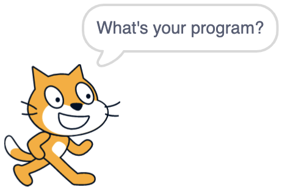

Since late 2012, I've been a parent. My oldest is an absolutely avid
coder. He loves the scratch programming language, and has made an
incredibly bevy of spectacular games, originally by following
[griffpatch](https://www.youtube.com/channel/UCawsI_mlmPA7Cfld-qZhBQA)
tutorials, and then moving on to his own stuff.

As a way of sharing time with him, I do some scratch of my own. It's a
fun way of spending time together and encouraging his interest. Of course,
as a professional software developer I like to explore what I can
accomplish in a given environment. So I thought I would implement the
esoteric langage [BrainFrig](https://en.wikipedia.org/wiki/Brainfuck)
in [scratch](https://scratch.mit.edu/).

BrainEff is a simple language, with only eight commands. From wikipedia:

> `>` 	Increment the data pointer (to point to the next cell to the right).
>
> `<` 	Decrement the data pointer (to point to the next cell to the left).
>
> `+` 	Increment (increase by one) the byte at the data pointer.
>
> `-` 	Decrement (decrease by one) the byte at the data pointer.
>
> `.` 	Output the byte at the data pointer.
>
> `,` 	Accept one byte of input, storing its value in the byte at the data pointer.
>
> `[` 	If the byte at the data pointer is zero, then instead of moving the instruction pointer forward to the next command, jump it forward to the command after the matching ] command.
>
> `]` 	If the byte at the data pointer is nonzero, then instead of moving the instruction pointer forward to the next command, jump it back to the command after the matching [ command.

BrainFart languages operate similar to a turing machine, with the idea of a single
pointer that moves along a tape, making modifications and performing some basic
conditional logic. Translating this into scratch means setting up a `List` variable,
and a variable for the pointer.

Then initialize the memory:

We then need a program to operate on. I thought it would be cute to have
Scratch Cat ask you for your program:

This is then read into the program variable:

Each unit of scratch code is called a block (they look a bit like lego
blocks, and they stick together similarly). Each block is a blocking operation,
that is, no further connected blocks are run until that block is finished. The
ask block is no different in this regard. Scratch has two means of code separation,
by message broadcasting, and by making custom blocks. A custom block is analagous
to making a function.

After a program is entered, the new program message is broadcast, this will
cause this code to run:

This code handle the "parsing and lexing" part of the interpreter, basically.
Next is just the code that runs the functional parts of the input program,
alters the memory, and creates output. Here are the parts for moving the pointer
around on the tape:

Here's the code for incrementing and decrementing the memory at the pointer
location:

Here's the IO code:

And finally, the tricky bit: the looping code.

This is the second time I've written a BrainFrag interpreter, and it's been fun
both times. BrainFrick is a funny language, as it's probably a lot more common to
write an interpreter for it than it is to write a program for it to run.
I got a good chortle out of my coding companion when I showed him
I had implemented another programming language in scratch, even if I had to
bowdlerize the name of the language when I was talking about it.