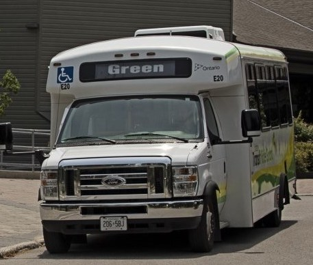

Happy 2s Day.

I was chatting with my brother the other day, and he opined that I may live in
Canada's largest municipality that doesn't have a municipal bus transit system. Of
course I was interested to find out which is the biggest Canadian city without
buses, so _here we go_.

<span class="more"></span>

I was very pleased to find that pandas will read an html page and output a list
of dataframes that it was able to parse from tables. Pair this with wikipedia
keeping a list of Canadian municipalities with public transport and we have a
good start:

```python
import pandas as pd
import requests

transit_url = "https://en.wikipedia.org/wiki/Public_transport_in_Canada"
r = requests.get(transit_url)
df_list = pd.read_html(r.text)
transit_municipalities = df_list[0]
```
<table border="1" class="dataframe">
  <thead>
    <tr>
      <th></th>
      <th>Name</th>
      <th>Municipalstatus[3][6]</th>
      <th>County[15]</th>
      <th>Incorporationyear[16]</th>
      <th colspan="5" halign="left">2021 Census of Population[15]</th>
    </tr>
    <tr>
      <th></th>
      <th>Name</th>
      <th>Municipalstatus[3][6]</th>
      <th>County[15]</th>
      <th>Incorporationyear[16]</th>
      <th>Population(2021)</th>
      <th>Population(2016)</th>
      <th>Change</th>
      <th>Land area(km²)</th>
      <th>Populationdensity</th>
    </tr>
  </thead>
  <tbody>
    <tr>
      <th>0</th>
      <td>Charlottetown</td>
      <td>City</td>
      <td>Queens</td>
      <td>1855</td>
      <td>38809</td>
      <td>36094</td>
      <td>+7.5%</td>
      <td>44.27</td>
      <td>2.0</td>
    </tr>
    <tr>
      <th>1</th>
      <td>Summerside</td>
      <td>City</td>
      <td>Prince</td>
      <td>1877[c]</td>
      <td>16001</td>
      <td>14839</td>
      <td>+7.8%</td>
      <td>28.21</td>
      <td>2.0</td>
    </tr>
    <tr>
      <th>2</th>
      <td>Alberton</td>
      <td>Town</td>
      <td>Prince</td>
      <td>1913</td>
      <td>1301</td>
      <td>1145</td>
      <td>+13.6%</td>
      <td>4.70</td>
      <td>2.0</td>
    </tr>
    <tr>
      <th>3</th>
      <td>Borden-Carleton</td>
      <td>Town</td>
      <td>Prince</td>
      <td>1995[d]</td>
      <td>788</td>
      <td>724</td>
      <td>+8.8%</td>
      <td>12.94</td>
      <td>2.0</td>
    </tr>
    <tr>
      <th>4</th>
      <td>Cornwall</td>
      <td>Town</td>
      <td>Queens</td>
      <td>1995</td>
      <td>6574</td>
      <td>5348</td>
      <td>+22.9%</td>
      <td>28.21</td>
      <td>2.0</td>
    </tr>
  </tbody>
</table>


Next, use the same technique to find a list of municipalities in each province.

```python

provinces = ['British Columbia', 'Alberta', 'Saskatchewan', 'Manitoba', 'Ontario', 'Quebec',
            'New Brunswick', 'Newfoundland and Labrador', 'Nova Scotia', 'Prince Edward Island']

p_dfs = {}
def p_url(p):
    return f"https://en.wikipedia.org/wiki/List_of_municipalities_in_{p.replace(' ', '_')}"

for province in provinces:
    print(f"getting municipalities for {province}")
    r = requests.get(p_url(province))
    df_list = pd.read_html(r.text)
    
    if province == 'Ontario' or province == 'Manitoba': # different html for these two.
        p_dfs[province] = df_list[1]
    else:
        p_dfs[province] = df_list[0]
    print(f"{province} has {len(p_dfs[province])} municipalities")
```

Clean that data up a bit, and work around the annoyingness of `MultiIndex`:

```python
canada_dfs = []

def find_series_by_column(df, look_for):
    for x in df.columns:
        if isinstance(x, tuple):
            if look_for in x[1]:
                pop_column = x[0]
                return df[x[0]][x[1]]
                break
            

for province, df in p_dfs.items():
    prov_series = pd.Series([province for x in range(len(df.index))])
    pop_series = find_series_by_column(df, 'Population')
    name_series = find_series_by_column(df, 'Name')
    canada_dfs.append(pd.DataFrame({"Province": prov_series, "Name": name_series, "Population": pop_series}))
canada_df = pd.concat(canada_dfs)
```

Gives data like this:

<table border="1" class="dataframe">
  <thead>
    <tr style="text-align: right;">
      <th></th>
      <th>Province</th>
      <th>Name</th>
      <th>Population</th>
    </tr>
  </thead>
  <tbody>
    <tr>
      <th>378</th>
      <td>Ontario</td>
      <td>Timmins</td>
      <td>41788</td>
    </tr>
    <tr>
      <th>890</th>
      <td>Quebec</td>
      <td>Saint-Thomas</td>
      <td>3249</td>
    </tr>
    <tr>
      <th>145</th>
      <td>Saskatchewan</td>
      <td>Tisdale</td>
      <td>2962.0</td>
    </tr>
    <tr>
      <th>827</th>
      <td>Quebec</td>
      <td>Saint-Patrice-de-Sherrington</td>
      <td>1960</td>
    </tr>
    <tr>
      <th>45</th>
      <td>British Columbia</td>
      <td>Terrace</td>
      <td>12017</td>
    </tr>
    <tr>
      <th>41</th>
      <td>Manitoba</td>
      <td>Louise</td>
      <td>2025</td>
    </tr>
    <tr>
      <th>806</th>
      <td>Quebec</td>
      <td>Saint-Modeste</td>
      <td>1162</td>
    </tr>
    <tr>
      <th>88</th>
      <td>Saskatchewan</td>
      <td>Langenburg</td>
      <td>1228.0</td>
    </tr>
    <tr>
      <th>395</th>
      <td>Quebec</td>
      <td>Mont-Tremblant</td>
      <td>9646</td>
    </tr>
    <tr>
      <th>52</th>
      <td>Saskatchewan</td>
      <td>Davidson</td>
      <td>1044.0</td>
    </tr>
  </tbody>
</table>

Do an anti-join to find the muncipalities without transit:

```python
with_transit_df = canada_df.merge(trans_df, on=['Name', 'Province'], indicator=True, how='left')
without_transit_df = with_transit_df.loc[with_transit_df._merge == 'left_only', :].drop(columns='_merge')
```

A little data cleanup:

```python
import re
without_transit_df['Population2'] = without_transit_df['Population'].fillna("0").map(lambda x:
        str(re.sub("\[\d+\]", "", str(x)))
     )
without_transit_df['Population2'] = without_transit_df['Population2'].map(
        lambda x: str(x).replace(".0", "").replace("nan", "0").replace(",", "")
    ).replace('', 0).astype('int32')
```

And sort:

<table border="1" class="dataframe">
  <thead>
    <tr style="text-align: right;">
      <th></th>
      <th>Province</th>
      <th>Name</th>
      <th>Population2</th>
    </tr>
  </thead>
  <tbody>
    <tr>
      <th>47</th>
      <td>British Columbia</td>
      <td>Vancouver</td>
      <td>662248</td>
    </tr>
    <tr>
      <th>44</th>
      <td>British Columbia</td>
      <td>Surrey</td>
      <td>568322</td>
    </tr>
    <tr>
      <th>1186</th>
      <td>Ontario</td>
      <td>Markham</td>
      <td>328966</td>
    </tr>
    <tr>
      <th>1356</th>
      <td>Ontario</td>
      <td>Vaughan</td>
      <td>306233</td>
    </tr>
    <tr>
      <th>2</th>
      <td>British Columbia</td>
      <td>Burnaby</td>
      <td>249125</td>
    </tr>
    <tr>
      <th>1156</th>
      <td>Ontario</td>
      <td>Kitchener</td>
      <td>233222</td>
    </tr>
    <tr>
      <th>41</th>
      <td>British Columbia</td>
      <td>Richmond</td>
      <td>209937</td>
    </tr>
    <tr>
      <th>1286</th>
      <td>Ontario</td>
      <td>Richmond Hill</td>
      <td>195022</td>
    </tr>
    <tr>
      <th>1251</th>
      <td>Ontario</td>
      <td>Oshawa</td>
      <td>159458</td>
    </tr>
    <tr>
      <th>7</th>
      <td>British Columbia</td>
      <td>Coquitlam</td>
      <td>148625</td>
    </tr>
    <tr>
      <th>19</th>
      <td>British Columbia</td>
      <td>Kelowna</td>
      <td>144576</td>
    </tr>
    <tr>
      <th>69</th>
      <td>British Columbia</td>
      <td>Langley</td>
      <td>132603</td>
    </tr>
    <tr>
      <th>1025</th>
      <td>Ontario</td>
      <td>Cambridge</td>
      <td>129920</td>
    </tr>
    <tr>
      <th>1371</th>
      <td>Ontario</td>
      <td>Whitby</td>
      <td>128377</td>
    </tr>
    <tr>
      <th>972</th>
      <td>Ontario</td>
      <td>Ajax</td>
      <td>119677</td>
    </tr>
    <tr>
      <th>85</th>
      <td>British Columbia</td>
      <td>Saanich</td>
      <td>117735</td>
    </tr>
    <tr>
      <th>2437</th>
      <td>Quebec</td>
      <td>Terrebonne</td>
      <td>111575</td>
    </tr>
    <tr>
      <th>2596</th>
      <td>Newfoundland and Labrador</td>
      <td>St. John's</td>
      <td>108860</td>
    </tr>
    <tr>
      <th>11</th>
      <td>British Columbia</td>
      <td>Delta</td>
      <td>108455</td>
    </tr>
    <tr>
      <th>1360</th>
      <td>Ontario</td>
      <td>Waterloo</td>
      <td>104986</td>
    </tr>
    <tr>
      <th>2872</th>
      <td>Nova Scotia</td>
      <td>Cape Breton</td>
      <td>94285</td>
    </tr>
    <tr>
      <th>1047</th>
      <td>Ontario</td>
      <td>Clarington</td>
      <td>92013</td>
    </tr>
    <tr>
      <th>49</th>
      <td>British Columbia</td>
      <td>Victoria</td>
      <td>91867</td>
    </tr>
    <tr>
      <th>1268</th>
      <td>Ontario</td>
      <td>Pickering</td>
      <td>91771</td>
    </tr>
    <tr>
      <th>23</th>
      <td>British Columbia</td>
      <td>Maple Ridge</td>
      <td>90990</td>
    </tr>
    <tr>
      <th>78</th>
      <td>British Columbia</td>
      <td>North Vancouver</td>
      <td>88168</td>
    </tr>
    <tr>
      <th>1457</th>
      <td>Quebec</td>
      <td>Brossard</td>
      <td>85721</td>
    </tr>
    <tr>
      <th>1886</th>
      <td>Quebec</td>
      <td>Repentigny</td>
      <td>84285</td>
    </tr>
    <tr>
      <th>1221</th>
      <td>Ontario</td>
      <td>Newmarket</td>
      <td>84224</td>
    </tr>
    <tr>
      <th>2496</th>
      <td>New Brunswick</td>
      <td>Moncton</td>
      <td>79470</td>
    </tr>
    <tr>
      <th>28</th>
      <td>British Columbia</td>
      <td>New Westminster</td>
      <td>78916</td>
    </tr>
    <tr>
      <th>1145</th>
      <td>Ontario</td>
      <td>Kawartha Lakes</td>
      <td>75423</td>
    </tr>
    <tr>
      <th>2497</th>
      <td>New Brunswick</td>
      <td>Saint John</td>
      <td>69895</td>
    </tr>
    <tr>
      <th>1022</th>
      <td>Ontario</td>
      <td>Caledon</td>
      <td>66502</td>
    </tr>
    <tr>
      <th>1226</th>
      <td>Ontario</td>
      <td>Norfolk</td>
      <td>64044</td>
    </tr>
    <tr>
      <th>34</th>
      <td>British Columbia</td>
      <td>Port Coquitlam</td>
      <td>61498</td>
    </tr>
    <tr>
      <th>1113</th>
      <td>Ontario</td>
      <td>Halton Hills</td>
      <td>61161</td>
    </tr>
    <tr>
      <th>29</th>
      <td>British Columbia</td>
      <td>North Vancouver</td>
      <td>58120</td>
    </tr>
    <tr>
      <th>1436</th>
      <td>Quebec</td>
      <td>Blainville</td>
      <td>56863</td>
    </tr>
    <tr>
      <th>990</th>
      <td>Ontario</td>
      <td>Aurora</td>
      <td>55445</td>
    </tr>
    <tr>
      <th>1766</th>
      <td>Quebec</td>
      <td>Mirabel</td>
      <td>50513</td>
    </tr>
    <tr>
      <th>1526</th>
      <td>Quebec</td>
      <td>Dollard-des-Ormeaux</td>
      <td>48899</td>
    </tr>
    <tr>
      <th>2881</th>
      <td>Nova Scotia</td>
      <td>Kings[g]</td>
      <td>47404</td>
    </tr>
    <tr>
      <th>1751</th>
      <td>Quebec</td>
      <td>Mascouche</td>
      <td>46692</td>
    </tr>
    <tr>
      <th>21</th>
      <td>British Columbia</td>
      <td>Langford</td>
      <td>46584</td>
    </tr>
    <tr>
      <th>2472</th>
      <td>Quebec</td>
      <td>Victoriaville</td>
      <td>46130</td>
    </tr>
    <tr>
      <th>1372</th>
      <td>Ontario</td>
      <td>Whitchurch-Stouffville</td>
      <td>45837</td>
    </tr>
    <tr>
      <th>1112</th>
      <td>Ontario</td>
      <td>Haldimand</td>
      <td>45608</td>
    </tr>
    <tr>
      <th>1097</th>
      <td>Ontario</td>
      <td>Georgina</td>
      <td>45418</td>
    </tr>
  </tbody>
</table>

This really isn't a satisfactory answer for me to be honest. Most of the entries on
this list were either missed in the join (e.g. Metro Vancouver not matching Vancouver,
similar issue for York Region), or the municipalities listed are part of a larger 
municipality that is served by public transit (e.g. Markham). Fixing those issues
would be possible, but a lot of work. It was time for the paretto principle. So I looked through the
list. This isn't definitive but I think that Kawartha Lakes, Ontario, (population
~75000), is the largest municipality in Canada without a municipal bus service. They do
have a municipal service with these [little half-bus, half-van things](https://www.kawarthalakes.ca/en/living-here/resources/Transit/CroppedDSC_1333-high.jpg) though, so maybe that counts.




