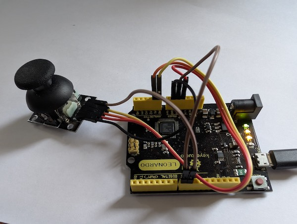

[Cookie clicker](https://en.wikipedia.org/wiki/Cookie_Clicker) is a video game
where the goal is to click a cookie many times. Each click increments a click counter,
and as the number of clicks increases power-ups are unlocked that accelerate
the counter incrementing rate. Clearly this is a silly and futile endeavor.
But not all silly and futile endeavors are entirely pointless. Enter the
[Arduino leonardo](https://en.wikipedia.org/wiki/Arduino_Uno), an IC controller
that can act as a keyboard and mouse.

<span class="more"></span>



*the device in question*

My idea was simple, use the arduino to send a continuous stream of mouse clicks.
One thing I learned from working with this thing in the past is that it's good to
have a failsafe mechanism. It's not fun to have a device sending hundreds of mouse clicks with no way to turn it off. So there's a connection between pin 8
and ground. When that is connected, mouse clicks will be sent continuously at
whatever x-y coordinate is currently on screen. To stop it, just unplug that
jumper wire. If I had a more well-stocked parts bin I would have used an on-off
switch.

So here's code that emulates the mouse with the joystick (with a left click option using joystick press) and the continuous click when the jumper is
attached.

```c
#include <Mouse.h>

int horzPin = A0;
int vertPin = A1;
int selPin = 9;         // Joystick button
int togglePin = 8;      // Jumper cable pin

int vertZero, horzZero;
int vertValue, horzValue;
const int sensitivity = 200;

int invertMouse = 1;

bool lastTogglePinState = HIGH;

void setup()
{
  pinMode(horzPin, INPUT);
  pinMode(vertPin, INPUT);
  pinMode(selPin, INPUT_PULLUP);
  pinMode(togglePin, INPUT_PULLUP);  // Jumper defaults to HIGH

  Serial.begin(9600);  // For logging

  delay(1000);
  vertZero = analogRead(vertPin);
  horzZero = analogRead(horzPin);

  Mouse.begin();
}

void loop()
{
  // Joystick movement
  vertValue = -(analogRead(vertPin) - vertZero);
  horzValue = analogRead(horzPin) - horzZero;

  if (vertValue != 0)
    Mouse.move(0, (invertMouse * (vertValue / sensitivity)), 0);
  if (horzValue != 0)
    Mouse.move((invertMouse * (horzValue / sensitivity)), 0, 0);
  bool currentToggleState = digitalRead(togglePin);
  if (currentToggleState == LOW) {
    Mouse.click();
  }
  if (currentToggleState != lastTogglePinState) {
    
    lastTogglePinState = currentToggleState;
    delay(100);  // Debounce
  }
}
```

When you plug this in you'll get the [uncanny clicker](https://cookieclicker.fandom.com/wiki/Uncanny_Clicker)
achievement in the game from clicking so fast.
