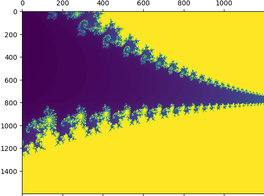

[Dask](https://docs.dask.org/en/stable/index.html) distributed
is a python package / distributed processing framework that gives
the ability to parallelize code execution across a cluster.

<span class="more"></span>

For a simple example, observe:

```python

def double(x):
    x * 2

scheduler_host = "whatever"
client = Client("tcp://{scheduler_host}:8786")
scattered_inputs = client.scatter(list(range(20)))
futures = client.map(double, scattered_inputs)

results = client.gather(futures)
```

Of course I had to do a mandelbrot viewer. A mandelbrot fractal
is great for parallelization because each pixel it computed 
independently of all others. The "heat map" generated by the
mandelbrot fractal algorithm is basically the same as how long it took to compute each point!

```python
from dask.distributed import Client
import dask
import numpy as np
import matplotlib.pyplot as plt


max_iter = 180

# reference implementation...
def get_mandelbrot_pts(x_y):
    iterations = 180
    x0, y0 = x_y
    x = float(0)
    xtemp = float(0)
    y = float(0)
    iteration = 0
    while ((x*x)+(y*y) < 4) and iteration < iterations:
        xtemp = x * x - y * y + x0
        y = 2 * x * y + y0
        x = xtemp
        iteration += 1
    return iteration

def inputs(w, h):  
    minx, maxx, miny, maxy = (-0.8, -0.7, -0.2, -0.05)

    inputs = []
    for x in range(w):
        for y in range(h):
            x0 = (maxx-minx)*float(x)/float(w) + minx
            y0 = (maxy-miny)*float(y)/float(h) + miny
            inputs.append((x0, y0))
    return inputs

w = 800
h = 600

# Dear reader, please don't hack me now that you have my internal IP
client = Client("tcp://192.168.1.163:8786")
scattered_inputs = client.scatter(list(inputs(w, h)))
futures = client.map(get_mandelbrot_pts, scattered_inputs)

results = client.gather(futures)

array_2d = np.array(results).reshape((w, h))

plt.axis('off')
plt.figure(figsize=(20,20))
plt.matshow(array_2d, fignum=1, aspect='auto')
plt.savefig('heatmap.png', bbox_inches='tight', pad_inches=0)
plt.close()
```

This will give you the standard fun image:



This only tells half the story though. We haven't talked about
running the scheduler and compute nodes!

On my local network I have many computers. Just for fun,
definitely not performance (this particular problem runs
better on one machine), I hooked up the following computers
as dask compute nodes:

- My 2019 MBP i7
- My Steam Deck
- A 2012 i7 Mac Mini
- Two raspberry pi 4s
- For fun, an Orange Pi Zero 2W
- My creaking old i5 PC

(I don't have a new-ish computer)

Enter dependency hell. Dask works on a "pickle everything"
serde model, but pickle is notoriously picky about sending
data between versions. Dask is super cool, but if I could 
make one criticism its that you can't inject your own serde
to use for IPC.

To sidestep dependency hell (*not today, Dependency Datan,
Dependency Jesus, take the wheel*) I decided to run
everything in docker. (Podman actually, but yes, docker is
Dependency Jesus) Since all my CPUs were basically idle
I think the overhead of running in docker is fine, especially
for a toy implementation. Here's the docker commands:

For the scheduler, only run once:
```
alias docker=podman
docker run --network=host ghcr.io/dask/dask dask-scheduler
```

Get your scheduler's IP of course, and then run this on any
node you want to be a compute node:

```
alias docker=podman
docker run --network=host ghcr.io/dask/dask dask-worker $SCHEDULER_IP:8786
```

All in all, it seems like a fun way to run code distributed. I
can see how certain problems that are very parallelizable
would be good to run this way, as compared to using something
like spark. You don't really need to learn a different mental
model of distributed computing for this framework. But, having
said that, the number of problems where this would be a performant 
solution may be limited, especially with being limited to python.

One drawback is that there doesn't appear to be any managed service 
for dask in the big cloud providers, which means if you wanted to use
this in production, you'd need to manage your own k8s cluster, which
is another level of pain and complexity that people prefer to
side-step.
