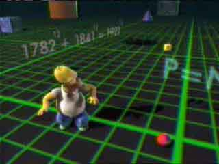

[Fermat&#8217;s Last Theorem][1] States that there are no non-trivial integer solutions solutions to the equation:
  
```
  
x^{n} + y^{n} = z^{n}, n > 2

```
  
  
This theorem went unproven for centuries, and was proven to be true in 1995 by Andrew Wiles. The [Treehouse of Horror VI][2] episode of the Simpsons aired the same year. People with a keen interest in humourous background gags could have done a freeze frame and seen the following ([source][3]:



The gag here is that if you punched in  

> 1782<sup>12</sup> + 1841<sup>12</sup>

to a pocket calculator, you would get the same answer as if you punched in:

> 1922<sup>12</sup>

 So this equation would seem to be true, but it&#8217;s not. It&#8217;s just really close, and the reason you see the same number is due to floating point rounding. I.e. it&#8217;s not actually true, but it&#8217;s close enough to fool the calculators of the day. Sadly I don&#8217;t know who found this near-solution to give credit. I remember hearing a commentary by David X. Cohen, who is a mathematician and writer for The Simpsons and Futurama, mentioned some details about this.

Finding near-solutions to FLT is actually quite easy though. You just have to do a brute force search and you can output whatever numbers you find that are close enough to what you are looking for. Just define your ranges of exponents and bases and loop through, looking for solutions that match a certain threshold. Here&#8217;s an example written in C#:

```csharp
using System;
using System.Collections.Generic;
using System.Linq;
using System.Text;

namespace ConsoleApplication1
{
    class Program
    {
        static void Main(string[] args)
        {

            string lookingFor = ".00000000";
            for (double exponent = 11; exponent &lt; 15; exponent++)
            {

                for (double doing = 701; doing &lt; 20002; doing++)
                {

                    double result = Math.Pow(doing, exponent);

                    for (double x = Math.Floor(doing * 0.5); x &lt; Math.Floor(doing * .95); x++)
                    {
                        double y1 = Math.Ceiling(Math.Pow(result - Math.Pow(x, exponent), 1 / exponent));
                        double y2 = Math.Floor(Math.Pow(result - Math.Pow(x, exponent), 1 / exponent));

                        // check the high number
                        double sum = Math.Pow(Math.Pow(y1, exponent) + Math.Pow(x, exponent), 1 / exponent);
                        string sumstring = sum.ToString();
                        if (sumstring.IndexOf(lookingFor) &gt; -1)
                        {
                            Console.WriteLine(doing + "^" + exponent + " = " + x + "^" + exponent + " + " + y1 + "^" + exponent + ", actually: " + sumstring);
                        }

                        // then the low.
                        sum = Math.Pow(Math.Pow(y2, exponent) + Math.Pow(x, exponent), 1 / exponent);
                        sumstring = sum.ToString();
                        if (sumstring.IndexOf(lookingFor) &gt; -1)
                        {
                            Console.WriteLine(doing + "^" + exponent + " = " + x + "^" + exponent + " + " + y2 + "^" + exponent + ", actually: " + sumstring);
                        }
                    }
                }
            }

            Console.ReadLine();
        }
    }
}
```

And doing this you can find some interesting near-solutions like:

```
[
  
19639^{11} = 15797^{11} + 19469^{11}, actually: 19639.0000000074
  
]
  
[
  
4472^{12} = 3987^{12} + 4365^{12}, actually: 4472.00000000706
  
]
  
[
  
14051^{13} = 11184^{13} + 13994^{13}, actually: 14051.0000000076
  
]

```

 [1]: http://en.wikipedia.org/wiki/Fermat%27s_Last_Theorem
 [2]: http://en.wikipedia.org/wiki/Treehouse_of_Horror_VI
 [3]: http://www.ohohlfeld.com/simpsonsmath.html
 [4]: /images/fermat.jpg
