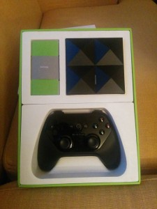

The ADT-1 is a neat little machine. It&#8217;s very sleak and designy.

<span class="more"></span>




I signed up for the developer version of Android TV because I&#8217;d like to port a game I wrote to the platform. And Google was nice enough to send one over.

But out of the box it doesn&#8217;t allow streaming videos over your home network, which seems like a must for an HTPC. The user interface on the ADT-1 is pretty much locked down. Google play is limited to very few titles. So let&#8217;s set up VLC.

Enable USB debugging on your ADT-1. Just go into your developer settings and turn it on.
[Connect to the ADT-1 using `adb`][1]. I did this over my network with the following command: 
```bash
adb connect {ip}:4321
```

[Download a VLC nightly APK.][2]
Install the apk using `adb`: 
```bash
adb install *.apk
```
    
This might take a minute. My wi-fi is as slow as molasses.</li> 
    
If you want to be fancy and start VLC over the network. This can be done in two stages. First, shell in to your ADT-1: 

```bash
adb shell
```
        
[Now you can load VLC with `am`][3]: 
        
```bash
am start -n org.videolan.vlc/org.videolan.vlc.gui.MainActivity
```

        
Or if you&#8217;re into doing things the easy way, you to Apps under settings and you should see VLC.
        
And that&#8217;s it. Now if you walk over to your ADT-1 you will see the bright orange face of VLC smiling at you. Have a nice day!

 [1]: https://developer.android.com/tv/adt-1/index.html#faq
 [2]: http://nightlies.videolan.org/build/android-armv7/
 [3]: https://github.com/mstorsjo/vlc-android/blob/master/Makefile
