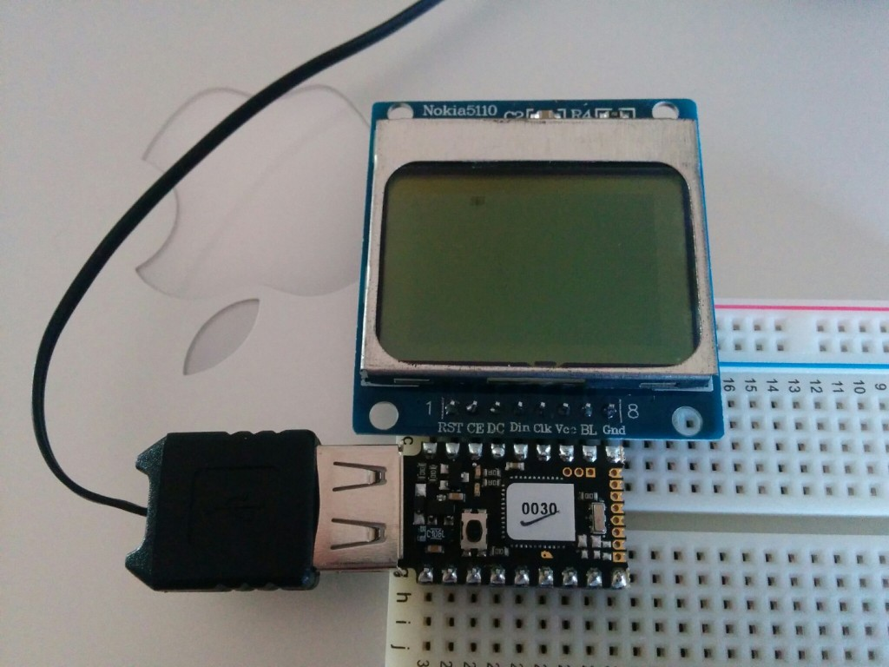

About a year ago I had a little fun using an [espruino][1]. I recently &#8220;kick-started&#8221; their more recent product the espruino pico. This one did really well on kickstarter and I got some great &#8220;boost&#8221; rewards like an LCD screen and some relays. It should be fun to see what this thing can do.

<span class="more"></span>




Below is a simple program that makes a spot spin around on the LED display that came with the kit. Variables like `A5` or `B10` represent pins on the board, which can be seen in the [pico schematic][2].

This makes use of the [PCD8544 driver][3], which works with the [espruino graphics library][4]. This is loosely based on some of the examples on the pico site.

```javascript
A5.write(0); // GND
A7.write(1); // VCC

// http://www.espruino.com/SPI
var spi = new SPI();
spi.setup({ sck:B1, mosi:B10 });

var height = 48; // these are the resolution of the Nokia 5110.
var width = 88;

var rate = 140;
var theta = 0;
var cx = width / 2;
var cy = height / 2 - 1;
var r = cy - 1;
var rx = r * 1.6;
var dTheta = 0.1;

var g = require("PCD8544").connect(spi,B13,B14,B15, function() {
  setInterval(function() {
    g.clear();
    theta += dTheta;
    var x = cx + rx * Math.cos(theta);
    var y = cy + r * Math.sin(2 * theta);
    g.drawLine(x + 1, y, x + 1, y + 1);
    g.drawLine(x, y + 1, x + 2, y + 1);
    g.flip();
  }, rate);
});
```

 [1]: http://benwendt.ca/blog/2014/02/07/getting-started-with-espruino/
 [2]: http://www.espruino.com/Pico
 [3]: http://www.espruino.com/PCD8544
 [4]: http://www.espruino.com/Graphics
