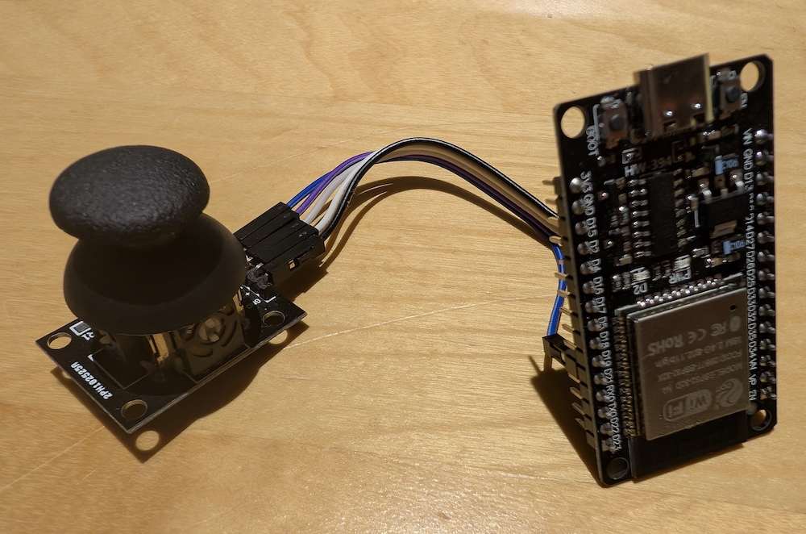

Using the `BLEMidi.h` library, you can get your esp32, the goat
of dev boards, to be a midi server (instrument), or client (it's
complicated).

<span class="more"></span>

It's pretty easy to get your esp32 to play notes:

```c
#include <BLEMidi.h>


void setup() {
  Serial.begin(115200);
  BLEMidiServer.begin("Basic MIDI device");
}

void loop() {
    if(!BLEMidiServer.isConnected()) {
        return;
    } 
    BLEMidiServer.noteOn(0, 80, 127);
    delay(100);
    BLEMidiServer.noteOff(0, 80, 127);

}
```

But that's not really an instrument. I am not a musician, but
I wanted something I could play. In walks my joystick unit I
used in my last post about making an automated mouse clicker.
Out walks this musical abomination:



If you connect the pin outs as directed, this code will turn your
joystick into an esp32 controlled octave pointer. Probably the worst
musical instrument ever. As I said, I'm no musician, but I tried to
record myself playing the easy intro part of ode to joy (E-E-F-G-G
etc.) on this and it was well beyond my ability.

Regardless it was a fun little project making a MIDI "instrument".

```c
/*
GND	GND
+5V	3.3V (preferred for safety)
VRx	GPIO 34
VRy	GPIO 35
SW	GPIO 27
*/

#include <math.h>
#include <BLEMidi.h>
#include <Arduino.h>

#define VRX_PIN 34
#define VRY_PIN 35

void setup() {
  Serial.begin(115200);
  BLEMidiServer.begin("Basic MIDI device");
}

void loop() {
  if(!BLEMidiServer.isConnected()) {
    return;
  }
  float x = analogRead(VRX_PIN) / 2048.0 - 1.0;
  float y = analogRead(VRY_PIN) / 2048.0 - 1.0;

  float theta = atan2(y, x);
  float degrees = theta * 180.0 / PI;
  float magnitude = sqrt(x * x + y * y);

  // don't play a note unless the joystick is far enough from center.
  if(magnitude > 0.5) {
    int note = map( (180 + degrees) / 3, 0, 360, 52, 76);

    Serial.print("Note: ");
    Serial.print(note);
    
    BLEMidiServer.noteOn(0, note, 127);
    delay(100);
    BLEMidiServer.noteOff(0, note, 127);
  }
}
```