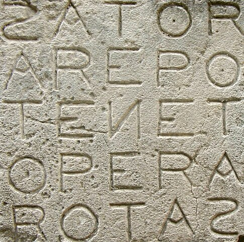

I had a visit with my mother recently where she introduced me to the idea of
[Sator Squares](https://en.wikipedia.org/wiki/Sator_Square). It's a five letter
acrostic, popular in ancient Rome, and originally rediscovered during the 
excavation of Pompei and Herculaneum. It has the interesting property that
transposition of the matrix is an identity operation.

<span class="more"></span>



_Image from wikipedia_

The drawing she wrote of it has been sitting on my counter for ages, and 
I've been meaning to code it ever since I first saw it.

Here's a definition of whether or not a collection of five words (assumed
to be five letters, which is safe because I'm re-using my wordle dictionary):

```python
def is_sator2(w0, w1, w2, w3, w4) -> bool:
    return w0[1] == w1[0] and w0[2] == w2[0] and w0[3] == w3[0] and w4[0] == w0[4] \
        and w1[2] == w2[1] and w1[3] == w3[1] and w1[4] == w4[1] \
        and w2[3] == w3[2] and w2[4] == w4[2] \
        and w3[4] == w4[3]
```

I tried using `itertools.permutations` to check every option, but it was horribly
inefficient, due to checking so many things that aren't even possibly sator squares.

Here's an optimization that can rip through thousands of words per second:

```python
# word_map is a mapping of first letters to words that start
# with that letter.
def look_for_sator(search_in, word_map):
    for word0 in search_in:
        print(word0)
        for word1 in word_map[word0[1]]:
            for word2 in word_map[word0[2]]:
                if word2[1] != word1[2]:
                    continue
                for word3 in word_map[word0[3]]:
                    if word3[1] != word1[3] or word3[2] != word2[3]:
                        continue
                    for word4 in word_map[word0[4]]:
                        if word4[1] != word1[4] or word4[2] != word2[4] or word4[3] != word3[4]:
                            continue
                        if is_sator(word0, word1, word2, word3, word4):
                            print("======")
                            print_sator((word0, word1, word2, word3, word4))
```

This will give nice outputs like:

```
hippo
======
hippo
idler
plead
peace
order
======
hippo
inlet
plant
pence
otter
======
hippo
inlet
plant
penne
otter
======
hippo
inlet
pleat
peace
otter
======
hippo
islet
plant
pence
otter
======
hippo
islet
plant
penne
otter
======
hippo
islet
pleat
peace
otter
```