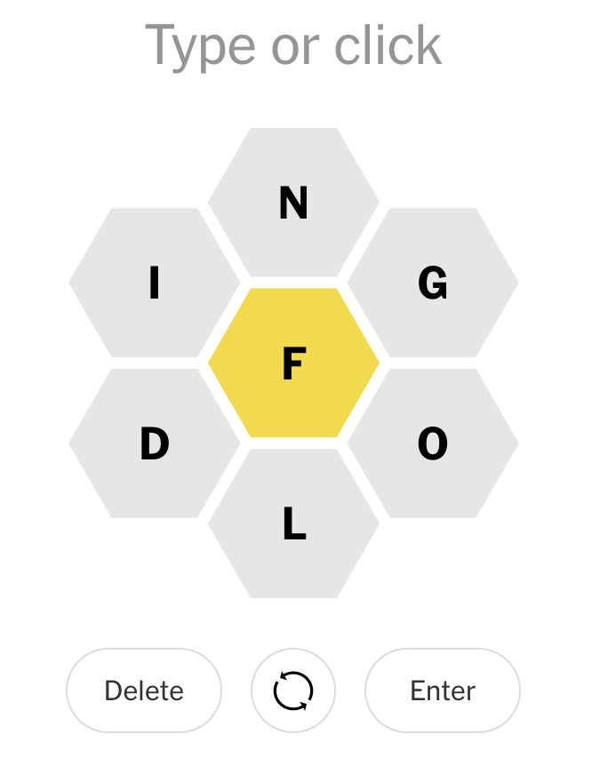
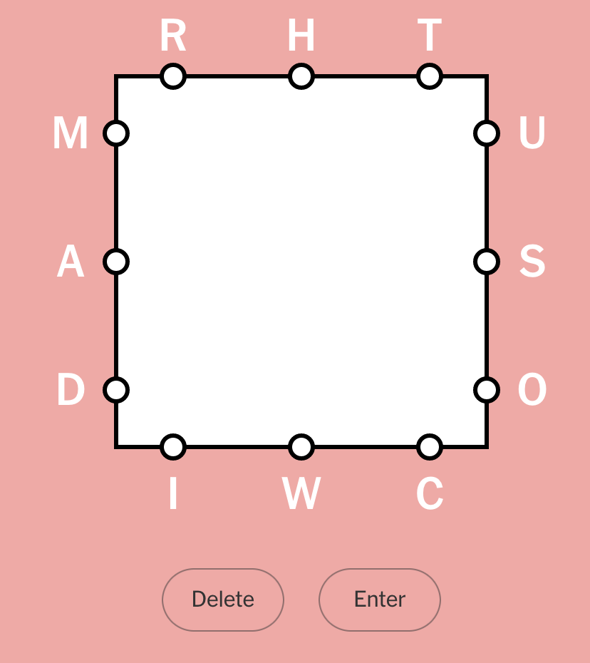

I've written _many_ times about solving wordle. I still play wordle most
days, but recently I've moved on to playing other daily games available
on the NYT site,
[spellling bee](https://www.nytimes.com/puzzles/spelling-bee) and
[letter boxed](https://www.nytimes.com/puzzles/letter-boxed). So let's
solve those too.

<span class="more"></span>



Spelling bee is just about spelling as many words as you can, but they
all have to inclue the central letter. The ideal is to get a
[pangram](https://en.wikipedia.org/wiki/Pangram), i.e. a word that
includes all the available letters.

Here's a regular expression that will find all possible solutions to spelling bee, assuming `clhawbe` are the available letters and `a` is
the mandatory letter:

```bash
grep -E '^[clhawbe]+$' /usr/share/dict/words | grep a
```

This doesn't solve the pangram but it should be clear how to extend to
solve for that.



Letter boxed is played on a box with three letters on each side. The aim
is to spell words that use up all the letters within five turns, but 
you cannot use two consecutive letters from the same side of the 
square. And each new word must start with the final letter of the
previous word. Here's a python that gives all the words you can spell.
First, we'll set up the dictionary and the letters we have to work with:

```python
from english_words import english_words_set

english_words = list(english_words_set)

groups = (('r','h', 't'), ('m', 'a', 'd'), ('u', 's', 'o'), ('i', 'w', 'c'))
```

Here's the function that can determine whether a word can be spelled 
given the rules of the game:

```python
def can_spell_word(word, groups, exclude_group=None):
    if word == "":
        return True
    for i, group in enumerate(groups):
        if i == exclude_group:
            continue
        if word[0] in group:
            return can_spell_word(word[1:], groups, i)
    
    return False
```

Ages ago I was talking programming with some colleagues. One mentioned
having trouble thinking about how to write recursive functions. A second
co-worker recounted something one of his professors had told him:

> The trick to writing recursive functions is to write it like it's already been written.

I love that expression.

Anyways, here's iterating through the dictionary to find the words you
can spell:

```python
found_words = []
for word in english_words:
    if len(word) < 3:
        # game rule of minimum letters.
        continue
    if can_spell_word(word, groups):
        found_words.append(word)
```

I didn't bother extending this to finding which groups of words can
solve letter boxed in a given number of turns, or the least number of
turns but it should be very doable from here.
